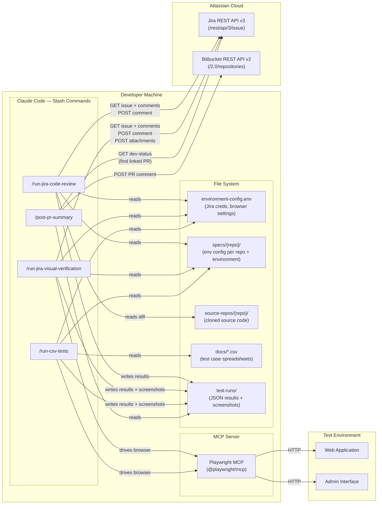
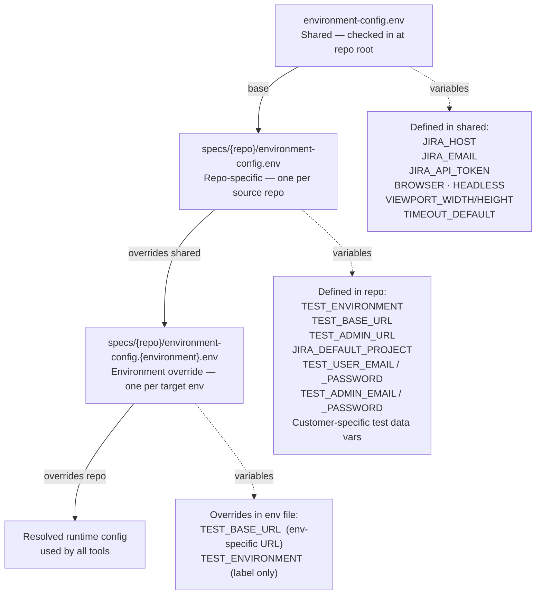

# AI QA Automation Suite

An AI-powered testing and code review toolkit built on top of Claude Code and the Playwright MCP server. I built this independently at Intygrate to replace and extend our existing QA tooling — it started as an experiment and has grown into a suite of tools the team actively relies on.

The suite consists of three tools, each driven by a Claude Code slash command:

| Tool | Command | What it does |
|------|---------|--------------|
| [AI Code Review](./code-review.md) | `/run-jira-code-review` | Reviews a PR diff against Jira AC, coding standards, and security rules — posts a structured report to Jira |
| [AI Visual Verification](./visual-verification.md) | `/run-jira-visual-verification` | Reads a Jira ticket, navigates the running app in a browser, verifies each AC visually, and posts pass/fail results with screenshots to Jira |
| [CSV Test Runner](./csv-test-runner.md) | `/run-csv-tests` | Runs baseline regression tests directly from a structured CSV spreadsheet — no separate spec files required |

---

## System component map

All three tools run inside Claude Code on the developer's machine. They read from the local file system (configs, source repos, CSV files), drive a browser via the Playwright MCP server, and communicate with Jira and Bitbucket over HTTPS.



---

## Configuration cascade

Each tool resolves its configuration by layering three files. Later layers override earlier ones, allowing the same shared credentials to serve multiple repos and environments.



**Example:** running `/run-csv-tests PROJ PROJ-qa` loads:
1. `environment-config.env` — Jira credentials
2. `specs/proj/environment-config.env` — project credentials and admin URL
3. `specs/proj/environment-config.proj-qa.env` — QA base URL override

---

## Project structure

```
intygrate-ai-autotesting/
├── .claude/
│   ├── commands/
│   │   ├── run-jira-visual-verification.md
│   │   ├── run-jira-code-review.md
│   │   ├── run-csv-tests.md
│   │   ├── post-pr-summary.md
│   │   └── create-spec.md
│   └── mcp_settings.json
├── specs/
│   ├── cartalchemy-v1/
│   │   └── environment-config.env
│   └── cartalchemy-v2/
│       └── environment-config.env
├── test-runs/
│   └── {YYYY-MM-DD}/
│       └── {repo_name}/
│           ├── results/
│           └── screenshots/
├── source-repos/
│   ├── cartalchemy-v1/
│   └── cartalchemy-v2/
└── environment-config.env
```
