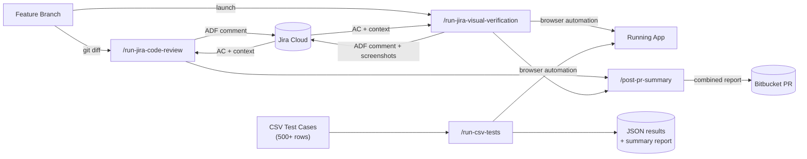
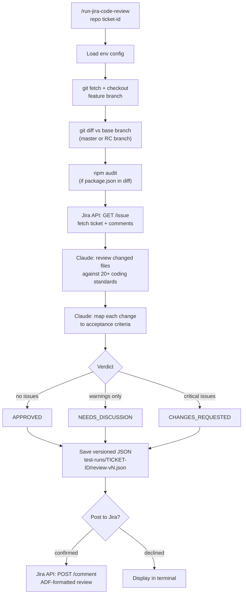
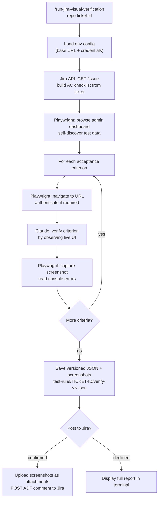
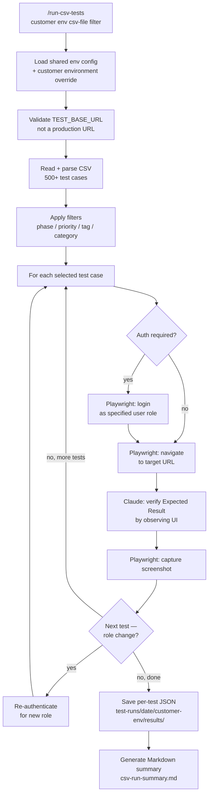

# AI QA Automation Suite

Three AI-powered tools that eliminate manual QA overhead for software delivery teams — no test scripting required.

| Tool | What it does | What it replaces |
|------|-------------|-----------------|
| [AI Code Review](#1-ai-code-review) | Reviews a feature branch against Jira AC and 20+ coding standards | Atlassian Rovo Dev, manual review checklists |
| [AI Visual Verification](#2-ai-visual-verification) | Opens a real browser and verifies the running app against each Jira AC, with screenshots | Manual UAT, ad-hoc acceptance testing |
| [CSV Test Runner](#3-csv-test-runner) | Executes 500+ test cases from a spreadsheet across multiple environments and user roles | Scripted Playwright / Cypress regression suites |

All three tools read context directly from Jira, drive a real browser via Playwright MCP, and post structured results back to Jira and Bitbucket.

**Stack:** Claude Code (claude-sonnet) · Playwright MCP · Jira REST API v3 · Bitbucket API · Git · npm audit

---

## System Architecture



---

## 1. AI Code Review

**Command:** `/run-jira-code-review <repo> <ticket-id>`

Checks out the feature branch, diffs it against the base branch, and reviews all changed files against the Jira ticket's acceptance criteria and the team's coding standards. Validates Jira mandatory fields (assignee, estimate, start/due dates). Produces a structured **APPROVED / CHANGES\_REQUESTED / NEEDS\_DISCUSSION** verdict and posts an ADF-formatted comment to the Jira ticket.

**Scope:** 20+ standards covering JavaScript style, error handling, Express/API conventions, MongoDB patterns, Handlebars templates, security (SSRF, path traversal, headers, crypto), database patterns (N+1, transactions, indexes), and PR hygiene.



**Key integrations:** `Jira REST API v3` (GET issue, GET comments, POST comment) · `git diff` · `npm audit`

**Example output:**
```
/run-jira-code-review cartalchemy-v2 PROJ-465
```

---

## 2. AI Visual Verification

**Command:** `/run-jira-visual-verification <repo> <ticket-id>`

Reads the Jira ticket's acceptance criteria, then uses Playwright MCP to navigate the running application and verify each criterion by observing the live UI. Self-discovers test data from the admin interface — only prompts the developer for data it cannot find autonomously. Each criterion produces a `PASS / FAIL / PARTIAL / BLOCKED` result with screenshot evidence. Screenshots are attached to the Jira ticket.



**Key integrations:** `Jira REST API v3` (GET issue, POST comment, POST attachments) · Playwright MCP (navigate, click, fill, screenshot, console, dialog, select)

**Example output:**
```
/run-jira-visual-verification cartalchemy-v2 PROJ-465
```

---

## 3. CSV Test Runner

**Command:** `/run-csv-tests <customer> <environment> <csv-file> <filter>`

Reads a spreadsheet of test cases (500+ rows) and executes them against a running application. Applies configurable filters by phase, priority, tag, or category. Manages browser sessions across tests — re-authenticating only when the user role changes. Produces a per-test JSON result and a Markdown summary report.

**CSV columns:** Test Case ID · Application · Test Case Name · Category · Description · Preconditions · Test Steps · Expected Result · Priority · URL Path · Auth Required · User Role · Company Selection Required · Test Data Notes · Tags · Spec ID · Phase Status · Phase Notes



**Supported roles:** Business · Sales Rep · Customer Services · Admin · Group

**Supported filters:** `phase1` · `critical-path` · `all-current` · custom tag

**Key integrations:** CSV file · Playwright MCP · per-environment config overrides (`environment-config.{env}.env`)

**Example output:**
```
/run-csv-tests PROJ proj-qa docs/test-cases-proj.csv phase1
```

---

## Design Principles

- **Outcome-based** — specifies *what should be true*, not *how to test it*; adapts to UI changes without updating test scripts
- **Jira-driven** — reads acceptance criteria directly from tickets; structured results posted back as ADF comments
- **Evidence-based** — every verdict backed by screenshots, console logs, or specific code references
- **Self-serving** — visual verification discovers test data from the admin interface autonomously; only asks when unavailable
- **Multi-tenant** — isolated config per repo/client; same framework supports multiple delivery teams and environments

---

## Quick Start

### Prerequisites

1. **Claude Code installed**
   ```bash
   npm install -g @anthropic-ai/claude-code
   ```

2. **Playwright MCP server added** (run this before opening Claude)
   ```bash
   claude mcp add playwright npx @playwright/mcp@latest
   ```

3. **Environment configured** — copy and edit the config files:
   ```bash
   # Shared config (Jira credentials)
   cp docs/environment-config-template.env environment-config.env

   # Repo-specific config (test URL, credentials)
   mkdir -p specs/{repo-name}
   cp specs/environment-config-template.env specs/{repo-name}/environment-config.env
   ```

### Running Commands

Navigate to the project directory and start Claude:

```bash
cd ~/company-ai-autotesting
claude
```

Then use these slash commands:

| Command | Description | Example |
|---------|-------------|---------|
| `/run-jira-code-review` | Review a branch against Jira AC and coding standards | `/run-jira-code-review cartalchemy-v2 PROJ-465` |
| `/run-jira-visual-verification` | Visually verify Jira AC in the running app | `/run-jira-visual-verification cartalchemy-v2 PROJ-465` |
| `/post-pr-summary` | Combine saved review + verification results into a PR summary | `/post-pr-summary PROJ-465` |
| `/run-csv-tests` | Execute test cases from a CSV spreadsheet | `/run-csv-tests xxxx xxxx-qa docs/test-cases-xxxx.csv phase1` |

---

## AI Code Review — Detailed Reference

### `/run-jira-code-review`

Reviews the code changes on a branch against the Jira ticket's acceptance criteria and team coding standards. Produces a structured report covering AC traceability, critical issues, warnings, Jira field validation, npm audit, and a delivery verdict.

**Usage:**
```
/run-jira-code-review <repo-name> <ticket-id> [base-branch]
```

**What it does:**
1. Fetches the feature branch from `./source-repos/{repo-name}/`
2. Diffs it against the base branch (prompts you to select one if not provided)
3. Fetches the Jira ticket and comments
4. Reviews all changed code against team coding standards
5. Validates changes against acceptance criteria
6. Runs npm audit if `package.json` was in the diff
7. Saves results locally: `./test-runs/{TICKET-ID}/review-{TICKET-ID}-v1.json`
8. Asks whether to post the full review as a Jira comment

**Prerequisites:** Source repo cloned and feature branch checked out:
```bash
cd source-repos/{repo-name} && git checkout feature/PROJ-465-description
```

---

### `/run-jira-visual-verification`

Opens a real browser and verifies the running application against the Jira ticket's acceptance criteria — navigating, interacting with the UI, and capturing screenshots as evidence.

**Usage:**
```
/run-jira-visual-verification <repo-name> <ticket-id>
```

**What it does:**
1. Fetches the Jira ticket and builds a verification checklist from the AC
2. Self-serves test data from the admin interface — only asks you for data it cannot find
3. Works through each criterion in the browser: navigate, interact, verify, screenshot
4. Records each criterion as `PASS`, `FAIL`, `PARTIAL`, or `BLOCKED`
5. Saves results locally: `./test-runs/{TICKET-ID}/verify-{TICKET-ID}-v1.json`
6. Screenshots saved to: `./test-runs/{TICKET-ID}/screenshots/v1/`
7. Asks whether to post the full verification report as a Jira comment

---

### `/post-pr-summary`

Reads the latest saved code review and visual verification results for a ticket and produces a combined quality summary. Designed to be posted on the open Bitbucket pull request so reviewers can see the AI's findings at a glance.

**Usage:**
```
/post-pr-summary <ticket-id>
```

The summary includes overall readiness (READY FOR REVIEW / NEEDS WORK / etc.), code review metrics, and a per-criterion verification table with a link to the full evidence on the Jira ticket.


---

### Result Storage

All code review and visual verification outputs are stored per ticket, versioned so multiple runs accumulate:

```
test-runs/
└── {TICKET-ID}/
    ├── review-{TICKET-ID}-v1.json      ← code review result
    ├── verify-{TICKET-ID}-v1.json      ← visual verification result
    └── screenshots/
        ├── v1/
        │   └── 01-description.png
        └── v2/
            └── 01-description.png
```

---

## CSV Test Runner — Detailed Reference

### `/run-csv-tests`

Reads a spreadsheet of test cases and executes them against the running application. Supports multiple environments, user roles, and filter presets.

**Usage:**
```
/run-csv-tests <customer> <environment> <csv-file> <filter>
```

**What it does:**
1. Loads shared config and customer/environment-specific overrides
2. Validates the target URL is not a production environment
3. Reads and parses the CSV; applies filters by phase status, priority, tags, and category
4. For each test: navigates to the URL, authenticates if required, verifies the expected result by observing the UI, and captures a screenshot
5. Maintains browser session across tests; re-authenticates only when the user role changes
6. Saves per-test JSON results and a Markdown summary report

**Output locations:**
- Per-test results: `./test-runs/{YYYY-MM-DD}/{customer}-{environment}/results/{spec_id}/`
- Summary: `./test-runs/{YYYY-MM-DD}/{customer}-{environment}/csv-run-summary.md`

**Filter presets:**
| Filter | Selects |
|--------|---------|
| `phase1` | High priority + critical-path tag + Business role tests |
| `critical-path` | All High priority + critical-path tagged tests |
| `all-current` | All tests with current phase status |
| `{tag}` | All tests matching a specific tag |

---

## Project Structure

```
company-ai-autotesting/
├── .claude/
│   └── commands/
│       ├── run-jira-code-review.md          ← /run-jira-code-review
│       ├── run-jira-visual-verification.md  ← /run-jira-visual-verification
│       ├── post-pr-summary.md               ← /post-pr-summary
│       └── run-csv-tests.md                 ← /run-csv-tests
├── ai-code-review/                          ← standalone package (copy into any repo)
│   └── .claude/
│       ├── CLAUDE.md
│       ├── README.md
│       └── commands/
├── specs/                                   ← YAML test specifications + env configs
│   └── {repo-name}/
│       └── environment-config.env
├── source-repos/                            ← cloned source repos (gitignored)
│   └── {repo-name}/
├── docs/
│   ├── test-cases-xxxx.csv                  ← 500+ test cases for xxxx client
│   ├── test-cases-CAV2.csv
│   └── ...
├── test-runs/
│   ├── {TICKET-ID}/                         ← code review & visual verification results
│   │   ├── review-{TICKET-ID}-v1.json
│   │   ├── verify-{TICKET-ID}-v1.json
│   │   └── screenshots/v1/
│   └── {YYYY-MM-DD}/{customer}-{env}/       ← CSV test run results
│       ├── results/
│       ├── screenshots/
│       └── csv-run-summary.md
└── environment-config.env                   ← shared Jira credentials
```

---

## Installation & Setup

### 1. Install Claude Code

```bash
npm install -g @anthropic-ai/claude-code
```

### 2. Add Playwright MCP Server

```bash
claude mcp add playwright npx @playwright/mcp@latest
```

### 3. Configure Environment

```bash
# Shared config (Jira credentials)
cp docs/environment-config-template.env environment-config.env

# Repo-specific config
mkdir -p specs/cartalchemy-v2
cp specs/environment-config-template.env specs/cartalchemy-v2/environment-config.env
```

Edit `environment-config.env` with your `JIRA_HOST`, `JIRA_EMAIL`, and `JIRA_API_TOKEN`.

Edit `specs/{repo-name}/environment-config.env` with `TEST_BASE_URL`, `TEST_ADMIN_URL`, and test credentials.

### 4. Get your Jira API token

1. Go to https://id.atlassian.com/manage-profile/security/api-tokens
2. Click **Create API token** and copy the value into your config

### 5. Verify credentials

```bash
source environment-config.env && curl -s -u "$JIRA_EMAIL:$JIRA_API_TOKEN" "https://$JIRA_HOST/rest/api/3/myself" | head -c 200
```

---

## Standalone Package

If developers want to run code review and visual verification **directly from within their own repo** (without cloning `company-ai-autotesting`), the `ai-code-review/` folder is a self-contained package they can copy in.

See [ai-code-review/.claude/README.md](ai-code-review/.claude/README.md) for setup instructions.

---

## Troubleshooting

### "Browser not installed"
```bash
npx playwright install chromium
```

### "Jira authentication failed"
1. Check credentials in `./environment-config.env`
2. Verify your Jira API token hasn't expired
3. Regenerate at: https://id.atlassian.com/manage-profile/security/api-tokens

### "Cannot navigate to URL"
1. Check `TEST_BASE_URL` in the repo-specific environment config
2. Ensure your local application is running

### Playwright MCP not working
```bash
claude mcp list   # verify it's listed
claude mcp add playwright npx @playwright/mcp@latest   # add if missing
```

---

## Further Reading

- [Architecture — detailed diagrams](docs/architecture.md)
- [AI Code Review & Visual Verification Summary](docs/ai-code-review-summary.md)
- [Slash Commands Guide](docs/Slash-Commands-Guide.md)
- [AI Testing System Prompt](docs/AI-Testing-System-Prompt.md)
- [Specification Template](docs/AI-Testing-Specification-Template.md)
- [Results Schema](docs/Results-Schema.md)
