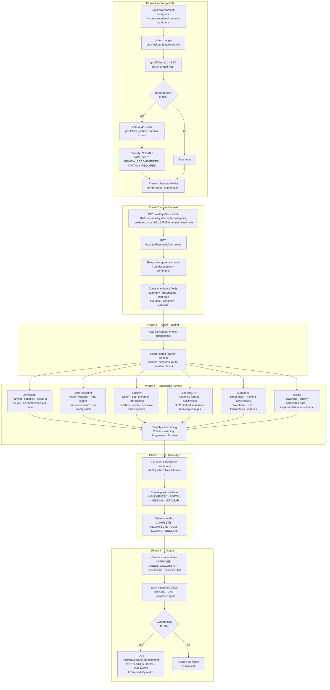
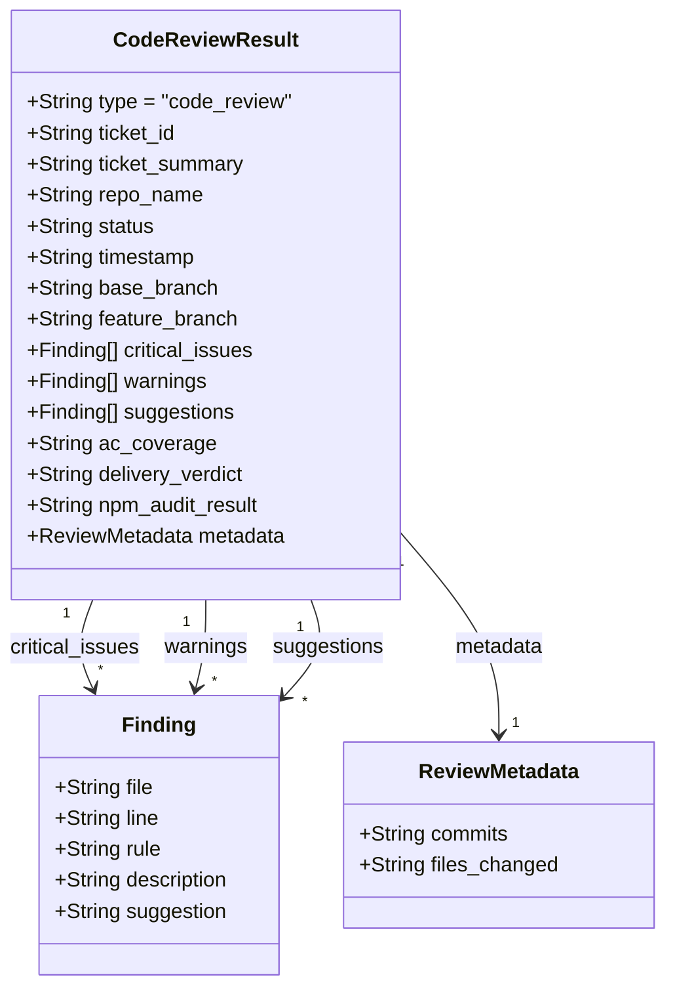

# AI Code Review

The code review tool replaced our existing Rovo Dev integration, which we were using for AI-assisted code review. I built a custom Claude-powered agent that does significantly more than a generic review — it analyses each PR diff against the specific Jira ticket's acceptance criteria, applies a structured set of coding standards and security rules, and produces a detailed, ticket-scoped report posted directly back to Jira as a comment.

The tool runs as a single slash command (`/run-jira-code-review`) from inside Claude Code. It reads the actual source code, fetches the Jira ticket, runs npm audit if package dependencies changed, and works through six sequential phases before producing a structured output with per-finding classifications and an AC traceability matrix.

For architecture in context with the other tools, see the [system component map](./README.md#system-component-map).

---

## Six-phase pipeline

The review runs six sequential phases. Phases 1–3 gather context (code diff, npm audit, Jira ticket). Phases 4–5 are AI analysis (standards review and AC coverage mapping). Phase 6 produces and optionally posts the result.

---

## Result data model

Reviews are saved as versioned JSON to `test-runs/{TICKET-ID}/review-{TICKET-ID}-vN.json`. Results are never overwritten — each run produces a new version, allowing multiple reviews per ticket to accumulate for audit and comparison.

---

## Planned improvements

**Risk-aware review overlay**

Extend the review to include a risk-sensitivity layer for high-impact areas of the codebase — payment pages, login and authentication flows, shared utility functions, or routes used across multiple modules. When a change touches one of these areas, the review would expand beyond the immediate ticket scope to assess broader interactions and downstream effects.

Still scoping whether this becomes a separate pass (`/run-jira-risk-review`) or an automatic additional check within the existing flow. Key design question: how to define "high risk" in a maintainable way — options include a curated list of paths in the repo config, file-level annotations, or Jira labels on tickets that touch sensitive areas.

**Automatic Bitbucket PR posting**

Enable `/post-pr-summary` to post directly to the Bitbucket pull request rather than requiring manual copy-paste. Currently blocked by SSO — Bitbucket uses separate authentication from Jira, and individual App Passwords are disabled when SSO is enforced at the workspace level.

Two paths to enable this:
- **Option A (recommended):** A Bitbucket workspace admin creates a service token not tied to any individual user account. SSO doesn't affect it. Stored in environment config alongside the Jira token. Permission needed: Pull Requests — Read & Write.
- **Option B:** A workspace admin enables App Passwords for SSO users, allowing each developer to create their own. More granular but requires per-developer setup.

Once either option is in place, a single config update (`BITBUCKET_ACCESS_TOKEN` in `.env`) is all that's needed — the command is already built and ready.

**In-repo deployment**

Roll out the tooling into individual repositories once it has been peer reviewed and tested, so developers can run commands directly from their own repo without a separate checkout.
