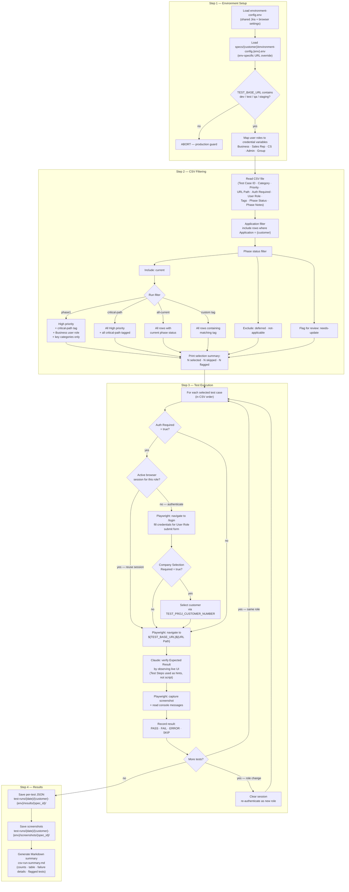
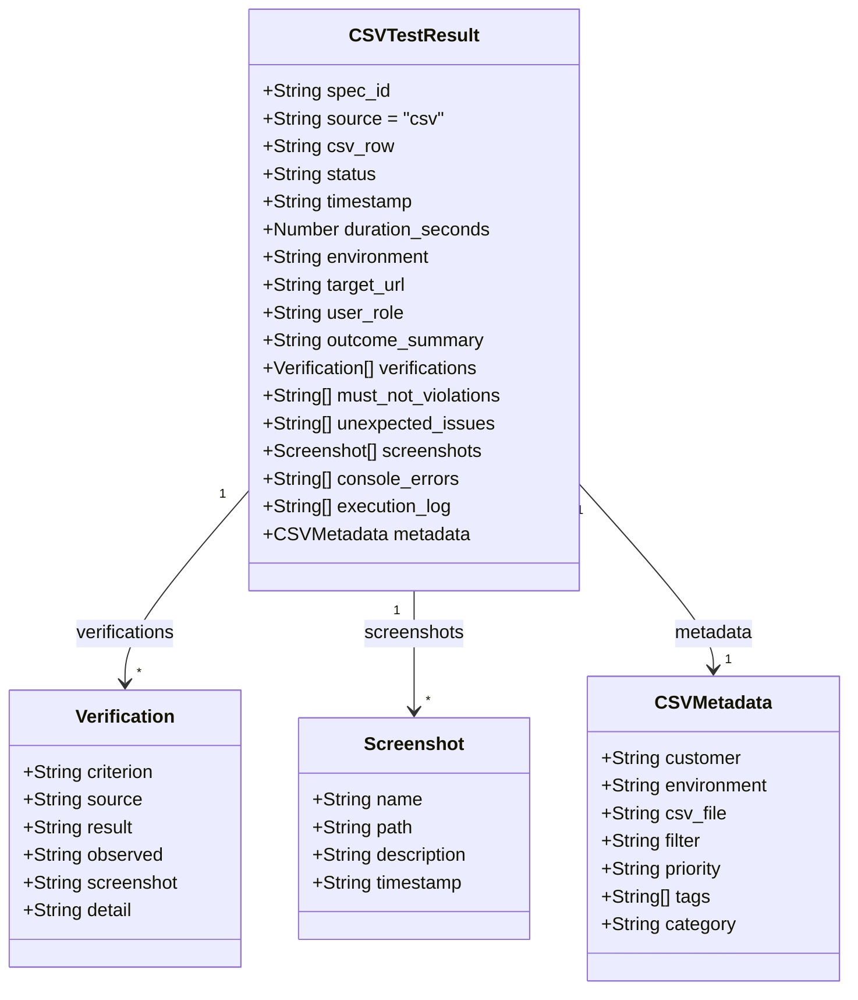

# CSV Test Runner

I built this tool to solve a specific problem that emerged as the CartAlchemy platform grew to serve multiple customers: fixing something for one customer can break it for another. Each customer runs a different ERP, different theme configuration, and different feature set — so a change to shared platform code carries real regression risk across the whole customer base. We needed a way to run baseline tests across all customer configurations before any production deployment.

The CSV spreadsheet is the single source of truth: each row is a test case scoped to a specific customer (application), and the runner reads it directly, filters to the relevant subset, handles authentication per user role, navigates the app via Playwright, and records a pass/fail result with screenshots. No individual spec files, no test framework boilerplate.

The tagging system is what makes it practical day-to-day. If a change touches wishlist functionality, you can run every test case tagged `wishlist` across all customers. If you just need a critical path end-to-end check before a deployment, `critical-path` gets you there in a focused run without executing the full suite. The filter combinations — by customer, phase status, priority, and tag — mean you can scope a run precisely to what's actually at risk.

The approach was validated against an initial customer deployment with a 566-test-case spreadsheet covering four user role types, role × feature access combinations, and flows including ERP integration, cart approval workflows, and WebAuthn. Additional customers are added by extending the spreadsheet with their application tag and environment config.

For architecture in context with the other tools, see the [system component map](./README.md#system-component-map).

---

## Filter logic and execution flow

---

## CSV structure

Each row in the spreadsheet maps to one test case:

| Column | Description |
|--------|-------------|
| `Test Case ID` | Unique identifier (e.g. `TC-001`) |
| `Application` | Which platform this test applies to |
| `Category` | Feature area (e.g. Login, Cart, Checkout) |
| `Priority` | High / Medium / Low |
| `URL Path` | Path appended to `TEST_BASE_URL` |
| `Auth Required` | true / false |
| `User Role` | Business · Sales Rep · CS · Admin · Group |
| `Tags` | Comma-separated (e.g. `critical-path, regression`) |
| `Phase Status` | current · deferred · not-applicable · needs-update |
| `Phase Notes` | Reason for deferred/needs-update status |
| `Expected Result` | What the AI verifies in the UI |
| `Test Steps` | Optional hints — not a strict script |

---

## Result data model

**Storage paths:**

| Artifact | Path |
|----------|------|
| Per-test result JSON | `test-runs/{YYYY-MM-DD}/{customer}-{env}/results/{spec_id}/{spec_id}-result.json` |
| Screenshots | `test-runs/{YYYY-MM-DD}/{customer}-{env}/screenshots/{spec_id}/` |
| Run summary | `test-runs/{YYYY-MM-DD}/{customer}-{env}/csv-run-summary.md` |

---
