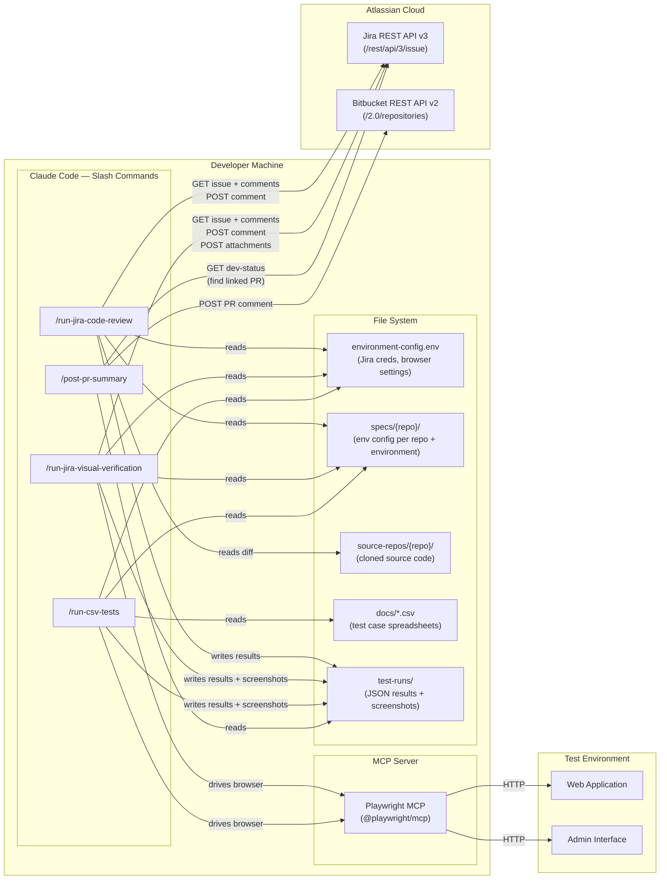
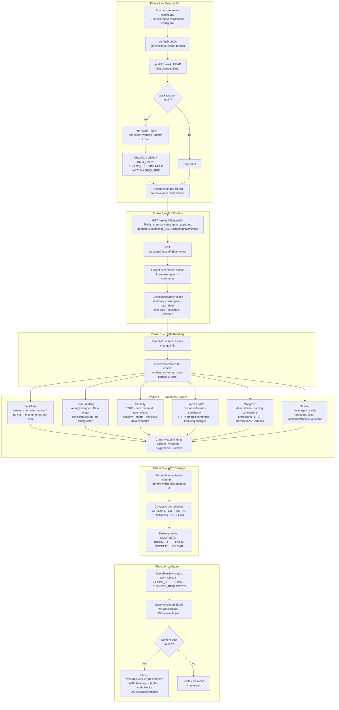
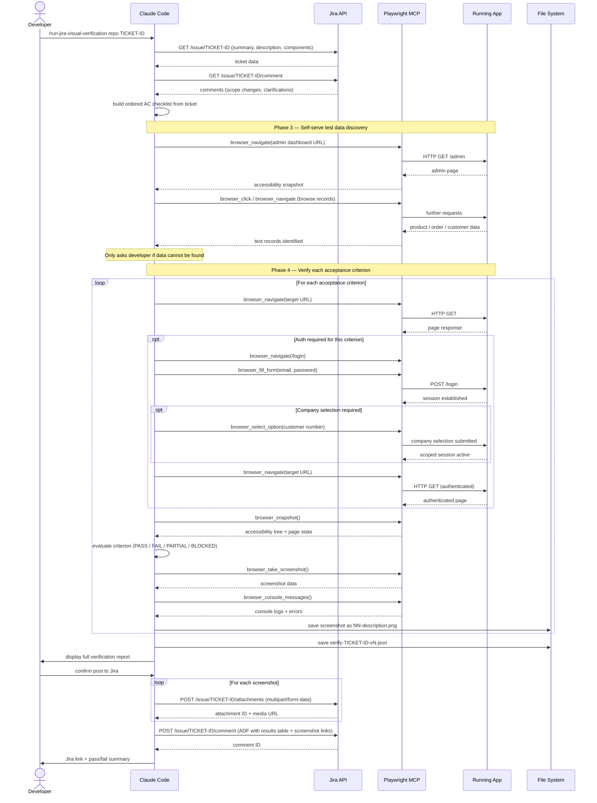
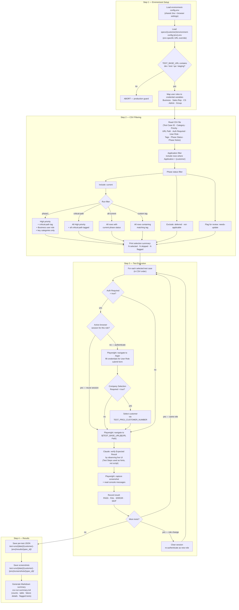
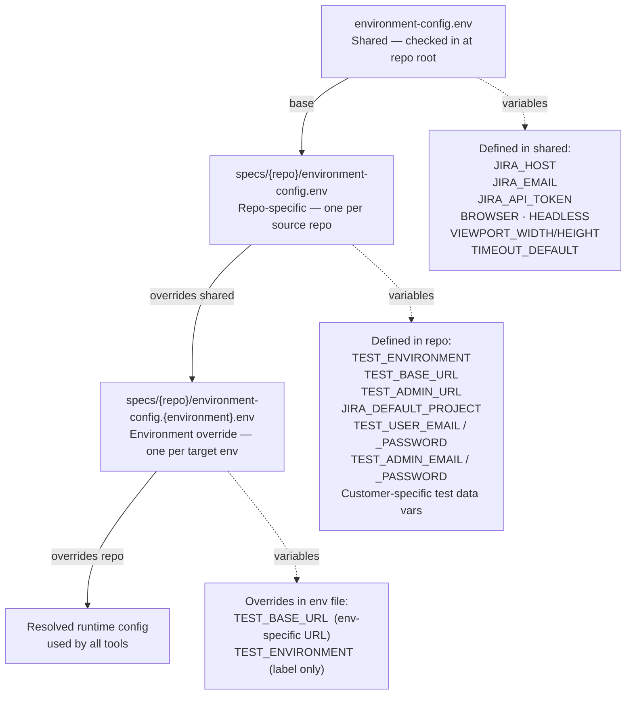
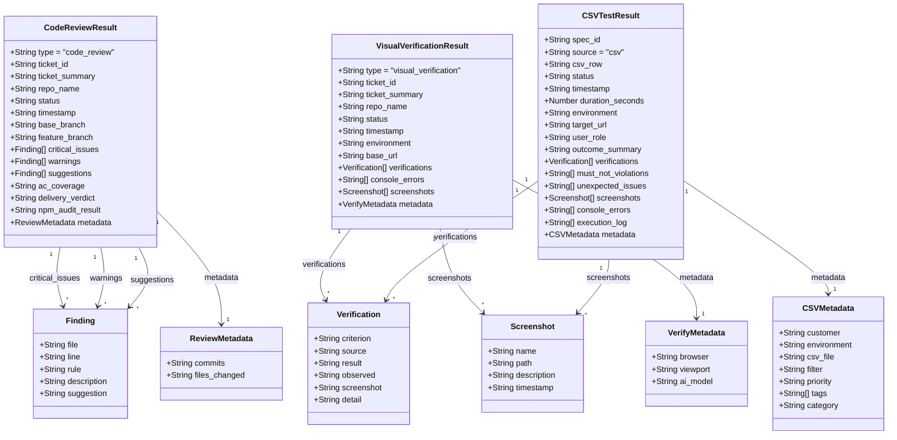

# Architecture

Detailed diagrams for each tool in the AI QA Automation Suite. For a high-level system overview, see the [README](../README.md).

---

## 1. System Component Map

All tools run inside Claude Code on the developer's machine. They read from a local file system (configs, source repos, CSV files), drive a browser via the Playwright MCP server, and communicate with Jira and Bitbucket over HTTPS.

---

## 2. AI Code Review — Six-Phase Pipeline

The code review runs six sequential phases. Phases 1–3 gather context (code diff, npm audit, Jira ticket). Phases 4–5 are AI analysis (standards review and AC coverage mapping). Phase 6 produces and optionally posts the result.

---

## 3. AI Visual Verification — Interaction Sequence

The visual verification tool is inherently interactive: Claude Code and Playwright MCP trade messages in a tight loop while navigating the application. This sequence diagram shows the full flow from command invocation to Jira posting.

---

## 4. CSV Test Runner — Filter Logic and Execution

The tool applies a two-stage filter before executing: first by application and phase status (removing deferred/not-applicable rows), then by the run filter (phase1, critical-path, all-current, or a custom tag). Session reuse avoids re-authentication between consecutive tests running under the same user role.

---

## 5. Configuration Cascade

Each tool resolves its configuration by layering three files. Later layers override earlier ones, allowing the same shared credentials to serve multiple repos and environments.

**Example:** running `/run-csv-tests PROJ PROJ-qa` loads:
1. `environment-config.env` (Jira credentials)
2. `specs/proj/environment-config.env` (proj credentials, admin URL)
3. `specs/proj/environment-config.proj-qa.env` (QA base URL override)

---

## 6. Result Data Model

All three tools write versioned JSON to `test-runs/`. The schemas share a common shape (type, ticket/spec ID, status, timestamp, verifications, screenshots) but differ in their metadata and source context.

**Storage paths:**

| Tool | Path |
|------|------|
| Code Review | `test-runs/{TICKET-ID}/review-{TICKET-ID}-vN.json` |
| Visual Verification | `test-runs/{TICKET-ID}/verify-{TICKET-ID}-vN.json` |
| Visual Verification screenshots | `test-runs/{TICKET-ID}/screenshots/vN/NN-description.png` |
| CSV Test Runner (per test) | `test-runs/{YYYY-MM-DD}/{customer}-{env}/results/{spec_id}/{spec_id}-result.json` |
| CSV Test Runner screenshots | `test-runs/{YYYY-MM-DD}/{customer}-{env}/screenshots/{spec_id}/` |
| CSV Test Runner summary | `test-runs/{YYYY-MM-DD}/{customer}-{env}/csv-run-summary.md` |

Results are always versioned (never overwritten), allowing multiple runs per ticket or test session to accumulate for audit and comparison purposes.
