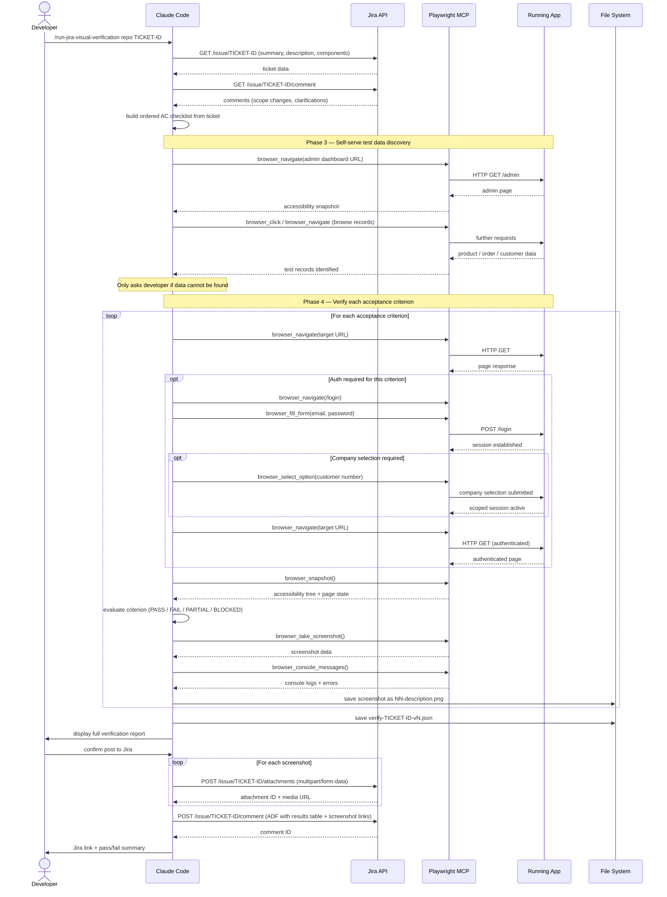
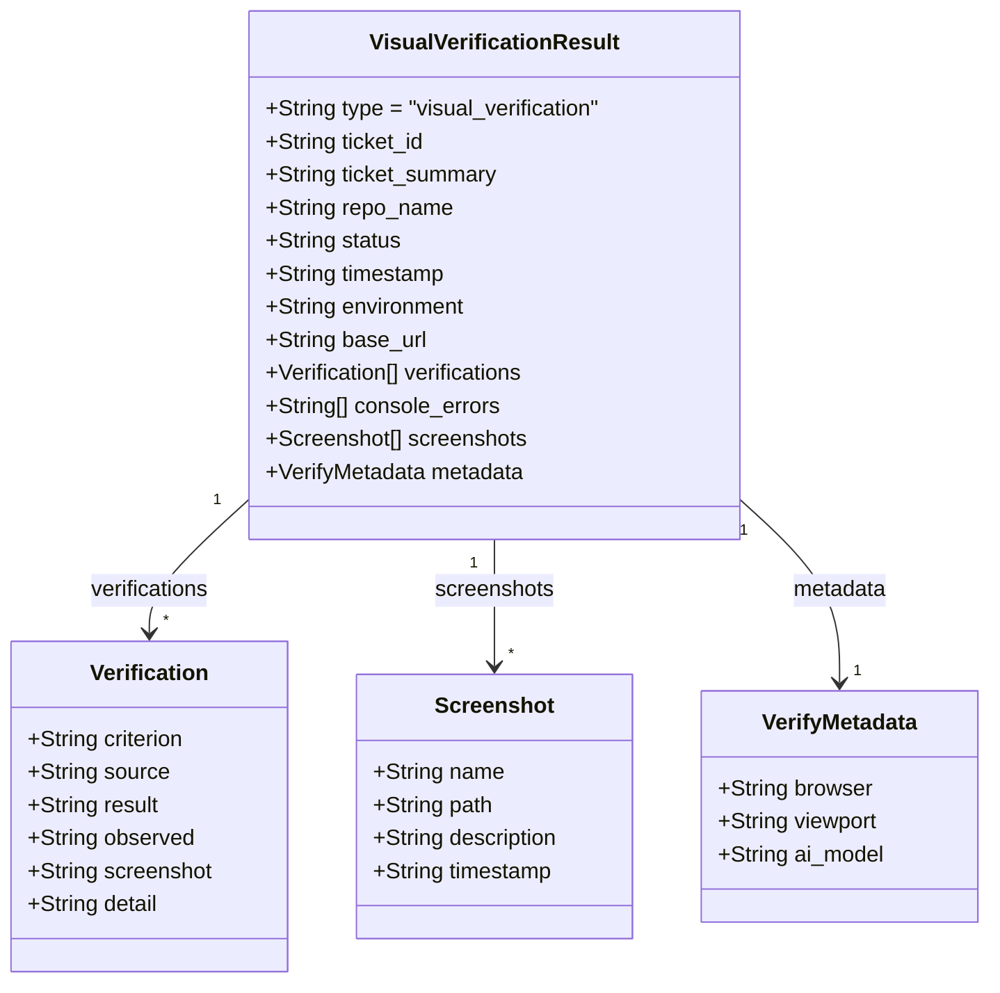

# AI Visual Verification

I built this tool to replace the manual AC verification step that typically happens at the end of a development ticket. Rather than a developer or tester manually clicking through the app to check each acceptance criterion, the tool reads the Jira ticket, navigates the running application in a real browser, and verifies each AC directly in the UI — then posts a structured pass/fail result with screenshot evidence back to the Jira ticket.

This is fundamentally different from traditional automated testing. There are no selectors to maintain, no brittle scripts tied to specific UI implementations, and no separate test suite to keep in sync with the codebase. The AI interprets what it sees the same way a human tester would, and can handle variation in implementation as long as the acceptance criterion is met.

The tool is driven entirely by the Jira ticket. A developer runs a single command (`/run-jira-visual-verification`) referencing a ticket ID — the AI reads the AC, determines what to verify, navigates the app, and posts results back to Jira. No setup per ticket. No test scripts to write.

For architecture in context with the other tools, see the [system component map](./README.md#system-component-map).

---

## Interaction sequence

The visual verification tool is inherently interactive — Claude Code and the Playwright MCP server trade messages in a tight loop while navigating the application. This sequence diagram shows the full flow from command invocation to Jira posting.



---

## Result states

Four result states are used so partial verification and obstacles are captured accurately without failing the whole run:

| State | Meaning |
|-------|---------|
| `PASS` | AC is fully satisfied as observed in the UI |
| `FAIL` | AC is not met |
| `PARTIAL` | AC is partially met — some conditions satisfied, others not |
| `BLOCKED` | Verification could not be completed (missing test data, app unavailable, bot protection) |

---

## Result data model

Verification results are saved as versioned JSON. Results are never overwritten — each run produces a new version, allowing multiple verifications per ticket to accumulate.



**Storage paths:**

| Artifact | Path |
|----------|------|
| Result JSON | `test-runs/{TICKET-ID}/verify-{TICKET-ID}-vN.json` |
| Screenshots | `test-runs/{TICKET-ID}/screenshots/vN/NN-description.png` |

---

## Current status and known issues

Active testing and refinement. Known areas being iterated on:

- Browser popup dismissal (cookie consent, password save dialogs)
- `allowedTools` configuration to reduce confirmation prompts during Playwright steps
- Handling proxy/connection errors from local dev server during test runs

Planned improvements identified during testing:

- **Negative test scenarios** — the current verification flow tests what should work. Needs extending to also test what shouldn't — restricted actions correctly blocked, error states displaying as expected, validation rejecting invalid input.

---

## Phase 2 — Webhook-triggered verification (planned)

Rather than requiring a developer to manually trigger verification, Phase 2 would automate it via webhooks. When code is deployed to a shared environment, a webhook fires and the verification runs automatically — no manual action required.

```
Code deployed to qa.company.co.uk
        ↓
Deployment webhook → Company server (HTTPS endpoint)
        ↓
Server validates webhook signature
        ↓
Queues verification job (extracts ticket ID from branch name)
        ↓
Claude Code CLI runs /run-jira-visual-verification
  ├── Fetches Jira ticket AC
  ├── Navigates qa.company.co.uk via Playwright
  ├── Verifies each acceptance criterion visually
  ├── Captures screenshots as evidence
  └── Posts full results to Jira ticket
        ↓
Developer sees verification results in Jira automatically
```


